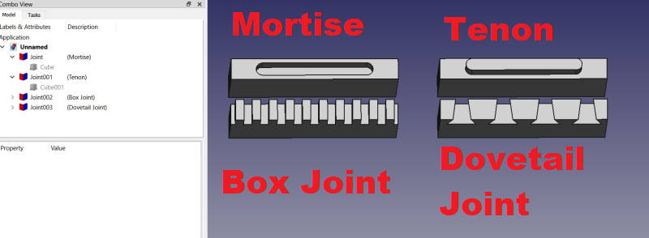
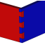

# Macro Joint (Work in progress)
Macro Joint is a macro to create joints in FreeCAD.  Usage: select a face and run the macro, select from the list the type of joint to make on that face.  Options are Mortise, Tenon, Box Joint, and Dovetail Joint.  A feature python object is created with user configurable editable properties.  Join works in Part Design and other workbenches. 
 
 

## Toolbar Icon
<a href="Macro_Joint_Icon.svg">Download</a> the toolbar icon:  
 

## Installation
Not yet available in the addon manager.  Install by placing the Joint.FCMacro into your macro folder.  On first run it will offer to create a new file called joint.py.  This file is needed for the Joint feature python objects to be parametric and functional upon reloading documents containing these objects.

## Usage
Select the face upon which you wish to create the joint, and run the macro.  A default joint with editable properties will appear in the tree.  Adjust the properties as desired, then create a mate for this joint on another face of another object.  The Mortise is the mate for the Tenon.  For the Box Joints and Dovetail Joints you will create another of the same type for the mate, setting the Use Odd property to True for the mate, usually.  For Dovetail Joints it might also be necessary to adjust the Angle X property to 90 degrees for the mate so that a good mate can be created.  Mortise, Tenon, and Box Joints are all fairly easy to make.  The Dovetail Joints will require more fiddling, but with some patience a good mate can always be created.

## Properties
Some properties are hidden for some joints where they are not used.  For example, the finger angle properties are not used with Mortise and Tenon joints, so those properties are hidden for those joint types.

## Dimensions (group)
Here I tried to put the properties related to the dimensions of the joints in one place.  All of these are float values interpreted as millimeters.  If you experiment with these values you can easily see which dimension each controls.

### Depth (float)
Depth is how deep into the face the joint will be or if it's a Tenon how far above the face it will extend.

### Finger Angle (float)
### Finger Angle2 (float)
Only used with Dovetail Joint types.  Finger Angle is the angle from the face to the tip of the joint.  Finger Angle2 is the angle from front to back if viewed from the front with the face on the xy_plane.  These 2 angles are not identical in terms of the spacing between one finger and the next, so you generally need to rotate the mate joint 90 degrees with the Angle X property to create a good matching mate unless the 2 parts are butting together straight on rather than at a 90 degree angle.

### Finger Width (float)
Used with Dovetail Joints and Box Joints.  It's the width of each finger.  For Box Joints this is very straight forward.  For Dovetail Joints it's more complicated.  With Dovetail Joints its the distance from the middle of the left side of the finger to the middle of the right side of the finger, when viewed from the front with the face on the xy_plane.  Note: the strongest joints are usually the Box Joints, and (up to a point), generally stronger the more fingers you have.  Dovetail Joints are often for cosmetic purposes unless it is a working joint where 2 surfaces are sliding against each other, such as with the cross slide of a lathe.

### Length (float)
This is the distance from the front to the back when viewed from the front with the face on the xy_plane.

### Width (float)
Not to be confused with Finger Width (for Dovetail and Box Joints), this is the total width of the joint.  For Mortise and Tenons this is the width of those objects.  For Dovetail and Box Joints this is the total width of all the fingers combined (and the spaces in between).  The number of fingers depends on this property along with the Finger Width property for the finger joint types, but there will always only be one object for Mortise and Tenons.  Of course, if you want more you can always position the Mortise/Tenon to one side and use a linear pattern to create more.  See the Position property for more on this.

### Offset (float)
Mating joints that are exactly the same size will be very difficult to assemble because the fit will be too tight.  The Offset property is used to increase/decrease the size of the objects that make up the joint.  You will need to experiment to determine the correct offset to use for your given situation, material used, glue used, etc.  On this note, care must be taken when making Dovetail Joints lest you end up with an impossible to assemble joint where the angles are such that the narrow end faces outward in all directions.

## Joint (group)
In this sections are properties related to the Joint objects, but not directly to either dimensioning or positioning.

### AddSubType (enumeration) (readonly)
This is for information only.  Values can be "Additive" or "Subtractive".  Currently, only the Tenons are Additive.  The rest are all Subtractive.  This is determined at the time of object creation and cannot be changed.  The difference comes into play when you use a pattern tool in Part Design, such as linear pattern or mirror.

### Boolean (boolean)
Default: True.  If set to False the cutting tool created is not cut from or fused with the object the face belongs to.  This might (or might not) be useful at times to be able to get at the cutting tool.

### Claim Children (boolean)
Default: False when in Part Design, True otherwise.  This only affects the view in the tree.  You can toggle this value to see the effect.

### Edit Face (boolean trigger)
Toggle this to True to bring up the face editor if you want to select a different face from the one originally selected when creating the joint object.  You can also double click the Joint object in the tree view to bring up this task dialog.

### Face (Link Sub)
This is a link to the face and to the object containing the face to which the joint is applied.

### Joint Type (enumeration)
This is an enumeration of the various joint types available.  This is normally selected during object creation when the macro is first run, but you can change it later here, too.  Options are: "Mortise", "Tenon", "Box Joint", "Dovetail Joint".  Note: the Tenon is an Additive type, so if you are using it in Part Design and you wish to make a pattern (array) of the Joint then you should delete the current joint and create a new one or else the pattern tool is likely to produce unexpected and unwanted results.  The other types are all Subtractive types and may be switched without issue.

### Refine (boolean)
This will appear in the Part Design in Part Design and in the Joint group if not in Part Design.  When True it removes some unnecessary coplanar edges from some faces.

## Positioning (group)
Here I have placed the properties related to positioning the joints along the face.  For Mortise and Tenon joint types these will not often be needed, but occasionally even with these types the joint will need to be rotated 90 degrees.  For Dovetail Joints extensive use of these properties will be required to produce a suitable mating joint.  All values are floats interpreted as millimeters or degrees.

### Angle (float)
The angle of the joint objects (in degrees) relative to the face with the axis being the center of the joint objects and the local Z axis of the joint object.  The local Z axis extends straight up from the surface of the face.

### Angle X (float)
The angle of the joint objects (in degrees) relative to the face with the axis being the center of the joint objects and the local X axis of the joint object.  The local X axis extends left to right as viewed from the front with the face on the xy_plane.  This property is usually needed (set to 90 degrees) for creating a mating Dovetail Joint.

### Angle Y (float)
The angle of the joint objects (in degrees) relative to the face with the axis being the center of the joint objects and the local Y axis of the joint object.  The local Y axis extends front to back as viewed from the front with the face on the xy_plane.  This property is not usually needed and is included for the rare cases where it might be needed and for the sake of completeness.

### Position (vector)
This property controls the position of the joint objects relative to the face.  With the Dovetail Joints this property will be indispensible, but for the other joint types it will only be rarely needed.  Most of the time you will use the X property to position the fingers of the Dovetail and Box Joints left to right.  Dovetail Joints will rarely mate properly without adjusting the X property.  With Box Joint and Dovetail Joints you might also want to adjust the X position for symmetry on the edges and to ensure there are not tiny (sometimes disconnected) fragments on the ends.  The Y and Z properties will only be rarely needed.

### Reversed (boolean)
This property controls the direction of the joint objects relative to the face.  In some cases the object faces in the wrong direction, but this is automatically resolved because the Symmetric property defaults to True, so the objects extend in both directions by default.

### Show Tool (boolean)
This is False by default.  Set it temporarily to True to aid in positioning the joint objects.  You might also want to use this to set the joint objects projecting above the plane of the face rather than cutting into it, but in such cases you will need to carefully tweak the Width propertie to remove the extra joint objects created to either side for use in cutting partial fingers on the ends of the joint.

### Symmetric (boolean)
Default: True.  If True the joint objects project in both directions, above and into the face.

### Use Odd (boolean)
Default: False.  You will generally need to set this to True for the mating joints, especially for Dovetail Joints.  The joint objects are place by default on the even numbered positions: finger, empty space, finger, empty space, etc.  If Use Odd is True you get fingers at the odd numbed positions: empty space, finger, empty space, finger, etc.  The X sub property of the Position property can also be used in some cases for proper mating.

## Changelog
### 0.2021.12.1 == add cantilever hook and mate joint types (latches)
### 0.2021.11.30 == rework dovetail code
### 0.2021.11.26.rev2 == uncomment __version__ property
### 0.2021.11.26 == initial upload
