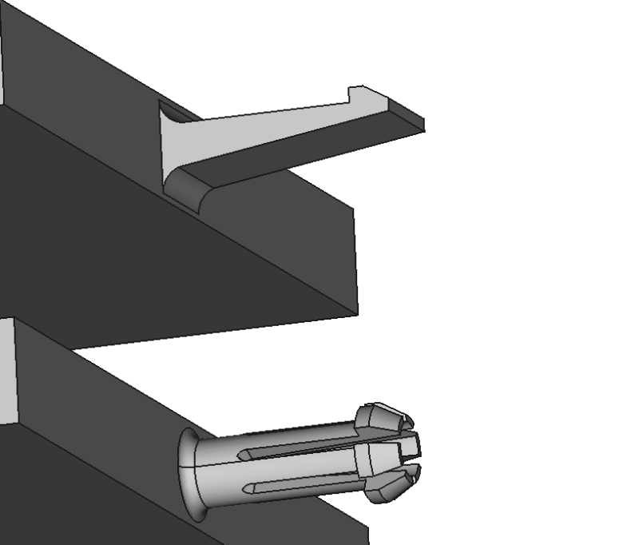

# Macro Joint
Macro Joint is a macro to create joints in FreeCAD.  Usage: select a face and run the macro, select from the list the type of joint to make on that face.  Options are Mortise, Tenon, Box Joint, Dovetail Joint, Cantilever Hook and Mate, Annular Hook and Mate, and Ball Joint and Mate.  A feature python object is created with user configurable editable properties.  Join works in Part Design and other workbenches.  Note: in the image below the "Finger Joint" is made using the Dovetail Joint type, but obviously with some different property values.  (None of these have actually been printed and tested at this time, so this is pretty much all "by guess and by gosh".  Some trial and error will be probably needed to find the optimal property values for the various joint types.)  
 
 
 
 

## Toolbar Icon
<a href="Macro_Joint_Icon.svg">Download</a> the toolbar icon:  
 

## Installation
Now available in the addon manager.  Or you can install by placing the Joint.FCMacro into your macro folder.  On first run it will offer to create a new file called joint.py.  This file is needed for the Joint feature python objects to be parametric and functional upon reloading documents containing these objects.

## Usage
Select the face upon which you wish to create the joint, and run the macro.  A default joint with editable properties will appear in the tree.  Adjust the properties as desired, then create a mate for this joint on another face of another object.  The Mortise is the mate for the Tenon.  For the Box Joints and Dovetail Joints you will create another of the same type for the mate, setting the Use Odd property to True for the mate, usually.  For Dovetail Joints it might also be necessary to adjust the Angle X property to 90 degrees for the mate so that a good mate can be created.  Mortise, Tenon, and Box Joints are all fairly easy to make.  The Dovetail Joints will require more fiddling, but with some patience a good mate can always be created.

## Properties
Some properties are hidden for some joints where they are not used.  For example, the finger angle properties are not used with Mortise and Tenon joints, so those properties are hidden for those joint types.

## Dimensions (group)
Here I tried to put the properties related to the dimensions of the joints in one place.  All of these are float values interpreted as millimeters.  If you experiment with these values you can easily see which dimension each controls.

### Depth (float)
Depth is how deep into the face the joint will be or if it's a Tenon or Cantilever Hook how far above the face it will extend.

### Finger Angle (float)
### Finger Angle2 (float)
Only used with Dovetail Joint types.  Finger Angle is the angle from the face to the tip of the joint.  Finger Angle2 is the angle from front to back if viewed from the front with the face on the xy_plane.  These 2 angles are not identical in terms of the spacing between one finger and the next, so you generally need to rotate the mate joint 90 degrees with the Angle X property to create a good matching mate unless the 2 parts are butting together straight on rather than at a 90 degree angle.

### Finger Width (float)
Used with Dovetail Joints and Box Joints.  It's the width of each finger.  For Box Joints this is very straight forward.  For Dovetail Joints it's more complicated.  With Dovetail Joints its the distance from the middle of the left side of the finger to the middle of the right side of the finger, when viewed from the front with the face on the xy_plane.  Note: the strongest joints are usually the Box Joints, and (up to a point), generally stronger the more fingers you have.  Dovetail Joints are often for cosmetic purposes unless it is a working joint where 2 surfaces are sliding against each other, such as with the cross slide of a lathe.

### Length (float)
This is the distance from the front to the back when viewed from the front with the face on the xy_plane.  For Cantilever Hook and Mate types this is the measurement of the baseline that butts against the face, not counting the fillets.  The longer this value the longer can be the calculated undercut because the material will have more flexibility the longer it is.

### Width (float)
Not to be confused with Finger Width (for Dovetail and Box Joints), this is the total width of the joint.  For Mortise and Tenons this is the width of those objects.  For Dovetail and Box Joints this is the total width of all the fingers combined (and the spaces in between).  The number of fingers depends on this property along with the Finger Width property for the finger joint types, but there will always only be one object for Mortise and Tenons.  Of course, if you want more you can always position the Mortise/Tenon to one side and use a linear pattern to create more.  See the Position property for more on this.  For Cantilever types the wider the better as this will add strength to the hook.

### Offset (float)
Mating joints that are exactly the same size will be very difficult to assemble because the fit will be too tight.  The Offset property is used to increase/decrease the size of the objects that make up the joint.  You will need to experiment to determine the correct offset to use for your given situation, material used, glue used, etc.  On this note, care must be taken when making Dovetail Joints lest you end up with an impossible to assemble joint where the angles are such that the narrow end faces outward in all directions.  This is hidden and unused for Cantilever types, which have a special property called Cantilever Mate Clearance, which is applied to the mate joint.

## Joint (group)
In this sections are properties related to the Joint objects, but not directly to either dimensioning or positioning.

### AddSubType (enumeration) (readonly)
This is for information only.  Values can be "Additive" or "Subtractive".  Currently, only the Tenons are Additive.  The rest are all Subtractive.  This is determined at the time of object creation and cannot be changed.  The difference comes into play when you use a pattern tool in Part Design, such as linear pattern or mirror.

### Boolean (boolean)
Default: True.  If set to False the cutting tool created is not cut from or fused with the object the face belongs to.  This might (or might not) be useful at times to be able to get at the cutting tool.

### Claim Children (boolean)
Default: False when in Part Design, True otherwise.  This only affects the view in the tree.  You can toggle this value to see the effect.

### Edit Face (boolean trigger)
Toggle this to True to bring up the face editor if you want to select a different face from the one originally selected when creating the joint object.  You can also double click the Joint object in the tree view to bring up this task dialog.

### Face (Link Sub)
This is a link to the face and to the object containing the face to which the joint is applied.

### Joint Type (enumeration)
This is an enumeration of the various joint types available.  This is normally selected during object creation when the macro is first run, but you can change it later here, too.  Options are: "Mortise", "Tenon", "Box Joint", "Dovetail Joint".  Note: the Tenon is an Additive type, so if you are using it in Part Design and you wish to make a pattern (array) of the Joint then you should delete the current joint and create a new one or else the pattern tool is likely to produce unexpected and unwanted results.  The other types are all Subtractive types and may be switched without issue.

### Refine (boolean)
This will appear in the Part Design in Part Design and in the Joint group if not in Part Design.  When True it removes some unnecessary coplanar edges from some faces.

### Rounded (boolean) (Mortise/Tenon only)
Default = True.  Specifies whether ends of joints will be rounded.  This applies to the left and right sides of the joints, so changing the Width property does not affect the radius of the curved ends, but changing the Length property does.  Set the Angle property to 90 degrees if you want top and bottom sides rounded.

### Scale (float)
Joints may be scaled, but care must be taken as the form factor that works for a given thickness might not work as well for another.  Consider also that scaling is one of the last operations performed, so clearances are also being scaled.  If a clearance of 0.5 mm is used successfully at 1.0 scale, and then the object is scaled to 0.5, then the clearance should be changed to 1 mm if the 0.5 mm absolute clearance is to be maintained.  This is 3D uniform scaling applied to the joint only (not to the object to which it is attached).

## Positioning (group)
Here I have placed the properties related to positioning the joints along the face.  For Mortise and Tenon joint types these will not often be needed, but occasionally even with these types the joint will need to be rotated 90 degrees.  For Dovetail Joints extensive use of these properties will be required to produce a suitable mating joint.  All values are floats interpreted as millimeters or degrees.

### Angle (float)
The angle of the joint objects (in degrees) relative to the face with the axis being the center of the joint objects and the local Z axis of the joint object.  The local Z axis extends straight up from the surface of the face.

### Angle X (float)
The angle of the joint objects (in degrees) relative to the face with the axis being the center of the joint objects and the local X axis of the joint object.  The local X axis extends left to right as viewed from the front with the face on the xy_plane.  This property is usually needed (set to 90 degrees) for creating a mating Dovetail Joint.

### Angle Y (float)
The angle of the joint objects (in degrees) relative to the face with the axis being the center of the joint objects and the local Y axis of the joint object.  The local Y axis extends front to back as viewed from the front with the face on the xy_plane.  This property is likely to be most useful when working with Cantilever Hook and Mate types.

### Position (vector)
This property controls the position of the joint objects relative to the face.  With the Dovetail Joints this property will be indispensible, but for the other joint types it will only be rarely needed.  Most of the time you will use the X property to position the fingers of the Dovetail and Box Joints left to right.  Dovetail Joints will rarely mate properly without adjusting the X property.  With Box Joint and Dovetail Joints you might also want to adjust the X position for symmetry on the edges and to ensure there are not tiny (sometimes disconnected) fragments on the ends.  The Y and Z properties will only be rarely needed.

### Reversed (boolean)
This property controls the direction of the joint objects relative to the face.  In some cases the object faces in the wrong direction, but this is automatically resolved because the Symmetric property defaults to True, so the objects extend in both directions by default.

### Show Tool (boolean)
This is False by default.  Set it temporarily to True to aid in positioning the joint objects.  You might also want to use this to set the joint objects projecting above the plane of the face rather than cutting into it, but in such cases you will need to carefully tweak the Width propertie to remove the extra joint objects created to either side for use in cutting partial fingers on the ends of the joint.

### Symmetric (boolean)
Default: True.  If True the joint objects project in both directions, above and into the face.

### Use Odd (boolean)
Default: False.  You will generally need to set this to True for the mating joints, especially for Dovetail Joints.  The joint objects are place by default on the even numbered positions: finger, empty space, finger, empty space, etc.  If Use Odd is True you get fingers at the odd numbed positions: empty space, finger, empty space, finger, etc.  The X sub property of the Position property can also be used in some cases for proper mating.  Unused for Mortise, Tenon, and Cantilever joint types.

## Cantilever (group)
Here we have special properties associated only with the Cantilever Hook and Cantilever Mate types.  Care must be taken in designing these joint types that the hook is oriented properly with the Mate part and that there is sufficient clearance during insertion and removal for the hook to be able to flex as needed.  It is also critical that the hook returns to an unstressed position upon full insertion for improved durability.

### Bottom Fillet Angle (float)
This is the angle, in degrees, of the fillet at the bottom of the Cantilever Hook relative to where it connects to the bottom (slanted) edge of the hook.  The other fillet is tangent to the opposite edge because it's a straight edge, but since this bottom edge is at an angle it is not a tangent connection.  Default is 110 degrees.  You can experiment to see the difference it makes. 
 
It is worth noting that the reason the top edge is straight and the bottom edge is angled is to improve durability.  Research has shown that Cantilever Hook designs with a constant thickness will break faster than those that are tapered to about 30% of the thickness (Length property) at the base of the hook.  Being tapered towards the end allows for greater flexibility of the hook during inserting and removing, thus improving the stress distribution rather than having most of the stress near the base, which is the weak point.

### Cantilever Mate Clearance (float)
This is the clearance (in millimeters) applied to the Cantilever Mate types (not to the Hooks, only to the Mates).  Default is 0.5 mm, which is the recommended tolerance for FDM 3D printers.  Use 0.3 mm for other 3D printer types.  All of this is untested at this point as I haven't yet made any test prints.

### Head Space Adjust (float)
Default: 0.  Use this to adjust the amount of free space between the tip of the hook and the back wall of the Cantilever Mate.  Bear in mind when adjust this that the hook will be flexing upon insertion and removal.  If in so doing it rubs against the back wall it might prevent it from functioning properly and might also lead to the hook being in a constant state of stress while fully inserted.

### Material Deflection (float)
The Undercut property is readonly and is calculated for you automatically, based on some formulas from a guide book from MIT on designing snap joints.  More flexible materials can use a higher Material Deflection value while stiffer materials will need a smaller value.  The Undercut property cannot be modified directly, but by modifying this property you can achieve longer or shorter undercuts.  The longer the undercut the more the hook will bend during latching.  Obviously, if you bend it too far it will break, but if the undercut is too short the latch might not hold the mated parts together well enough.  For a design that will be seldom opened and closed you can probably risk a bit more undercut.

### Nose Angle (float)
This is the angle of the nose, the tip of the hook.  Default is 60 degrees.  Adjusting the angle also adjusts the length of the nose, but does not affect the undercut calculation.

### Radius Factor (float)
It is highly recommended to have a fillet at the base of the Cantilever Hook.  This property sets the fillet radius to 60% of the Length property (the distance between the fillets).  This 60% ratio is optimal due to diminishing returns at higher percentages, but a higher ratio can be even better, but at the expense of some other durability concerns with some manufacturing processes due to residual stresses.

### Shape Deflection (float)
Default is 1.09. This is used in the formula to calculate the optimal undercut.  It is based on the fact we are using a rectangular cross-section for the Cantilever Hooks.

### Taper (float)
Optimal designs call for the hook to taper to a fraction of its thickness (Depth property) at the end as compared to the thickness at the base.  The default is to be 0.3 of the base thickness at the tip.  Permissible ranges go from 0.01 to 1.0 (constant thickness through length of hook).  Recommended ranges are from 0.3 to 0.5.

### Undercut (float -- readonly)
This value is calculated for you based on the Depth, Length and the two Deflection properties discussed above.  The undercut is the amount that the hook must be able to flex during insertion and removal.  It's also how much "bite" the hook has when in the fully inserted position.  The Width property does not come into play when calculating the undercut, so you can go wider for more durability, space permitting, without affecting the undercut except to make the hook wider.

### Undercut Angle (float)
This is the angle of the undercut (default: 0 degrees).  A negative angle will make removal easier while a positive angle makes for a more permanent joint.  Care must be taken when setting a positive aggressive angle to ensure there is room for the hook to slide into position on insertion and not remain in a stressed position.  For this, the Undercut Position Tweak can be used to tweak the position of the undercut.  Take note also: the joint will necessarily be looser if more clearance is needed for the hook to snap into place when using positive angles for the undercut.  Some trial and error is likely to be needed.

### Undercut Position Tweak (float)
This property allows to customize the Cantilever Hook and Mate types by tweaking the position of the undercut.  Move it out a bit further to improve the flexibility of the hook or in a little closer if you want a shorter hook.  But beware that if the hook is too short for the flexibility of the material being used it will be more prone to breaking.  If an aggressive undercut angle (positive value) is used this property should be also used to give the hook a bit more clearance to be able to snap into position upon insertion.

## Annular (group)
The Annular Hook and Annular Mate joints are very similar to the Cantilever types and share many of the same properties.  For example, the same face used to make the Canitlever Hooks is also used to make the Annular Hooks, only instead of extruding the face it is revolved.  There is a similar case for the Cantilever and Annular Mates, although in this case the faces are very slightly different.

### Diameter Tweak (float)
Use this to tweak the diameter of the Annular types.

### Slot Angle (float)
Interpreted as degrees.  For Annular Hook types this property defines the size of the slots cut into the hooks.  For example, a 90 degree slot angle would cut 1/4 turn out of the hook for each slot.  The bigger the slots, the more room the hook has to compress while being inserted.

### Slot Bottom (float)
This is a constrained value between 0.01 and 1.00.  It marks the position of the bottom of the slot, as a ratio of the overall height.  The default is 0.25, which means the slot bottom begins 1/4 the way up the hook.  The lower this value the longer the slots will be and the more flexible will be the hook.

### Slot Count (integer)
The number of slots (if any) to cut from the Annular Hook.  Default is 6.  If 0 is used, then no slots will be cut.

### Slot Tool Fillet Radius (float)
Default is 0.5 mm.  This is the radius applied to the cutting tool used to create the slots in the Annular Hooks.

## Ball Joint (group)
Ball Joint and Ball Mate types use spherical shapes.  The ball has slots cut into it to enable it to compress upon insertion into the Ball Mate.  The Ball Joint consists of a stem and a ball.  The ball sits atop the stem.  There is a fillet at the base of the stem where it meets the face and another fillet where the stem meets the ball.  The position of the slots is determined by the Ball Slot Start property, but you may elect to not have any slots if you prefer.  There are also two optional cutting tools for the core of the ball -- a sphere and a cylinder.  The core tool objects must, of course, be smaller than the radius of the ball or else all of the ball will be cut away.

### Ball Fillet Radius (float)
This is the radius of the fillets applied to the stem edges, in millimeters, where it meets the ball and the face to which the joint is attached.  A failure point for this joint is where stem meets base.  Having a fillet helps to evenly distribute the stress and improve the durability of the joint.

### Ball Mate Start (float)
Ball Mate only.  This is a number between 0 and 1 that determines where the opening for the ball joint is at in relation to the radius of the ball.  If the opening is too far down in the direction of the south pole, then the opening will be too small and the ball joint will not be able to deflect enough to fit into it.  If it's too high (above the equator), then the ball joint will not stay in place.  0 would be the south pole, 0.5 would be the equator.  You probably will get best results somewhere in the tropic of capricorn, to continue the earth analogy.  Honestly, I'm not sure yet the best value for this property.  It needs some trial and error testing and will depend also on the fit desired, material used, the slots made in the ball joint, and so on.  Default is 0.33, but take that with the proverbial grain of salt.

### Ball Radius (float)
Radius of the Ball Joint (and Ball Mate).  It's not clear by reading various guides whether the ball joint and the mate radii should be equal or if the ball joint should be slightly smaller.  Recommendations range from 0.0 mm (same size) to 0.3 mm, depending on the fit desired.  There is no offset property.  Just make the ball slightly smaller or the mate slightly bigger if you like.

### Ball Slot Count (integer)
The number of slots to cut into the Ball Joint.  The slots cut all the way across, unlike the slots in the Annular Joints, which cut only half the way through.  So you get 2 for the price of 1, so to speak.  The slots enable the ball to deflect / compress upon insertion into the ball mate.

### Ball Slot Start (float)
This is a value between 0 and 1.  It marks the bottom of the slots, relative to the bottom of the ball as a percentage of the diameter.  A value of 0.5, for example, would have the slots starting at the equator.  Default is 0.2.

### Ball Slot Thickness (float)
This is the thickness of the slots, in millimeters.

### Ball Slot Tool Core Radius (float)
This is the radius of the cylinder used as a core tool, to cut out the inside of the ball.  It starts at the same position (very slightly below) where the ball slots start and extends up through the north pole.  You may set this radius to 0 if you don't want the core cut out of the sphere.

### Ball Slot Tool Core Sphere Radius (float)
This is similar to the cylindrical core tool except this one is spherical.  It cuts the interior out of the ball.  Therefore, it is critical that the radius of this cutting tool is less than the radius of the ball or else all of the ball will be cut away.

### Ball Slot Tool Fillet Radius (float)
The radius of the fillets used on the slot cutting tool.

### Ball Stem Length (float)
Length of the stem.  You must have some minimal amount of stem or else the macro will fail.

### Ball Stem Radius (float)
The radius of the stem.  It should ordinarily be smaller than the radius of the ball.  If it's too small it might be more prone to failure.  If it's too large it might not fit in to the Ball Mate, which is based on the radius of the ball joint where the Ball Mate Start property sets the position of the opening.

## Split Joint (group)
Split Joint and Split Mate types are snap joints that feature 2 spheres, each on a split column.  These use the Length, Depth, Width, and Offset properties, same as used by the Mortise and Tenon types.  But there are also a few special properties relevant only to the Split Joint types.  The float properties are all interpreted as millimeters (just like everywhere else in this macro when it comes to length properties.)

The Offset property may be used to make the Split Mate slightly larger (or the Split Joint slightly smaller) to get clearance for a suitable fit.  Alternatively, the Scale property may also be used.  Or, you can tweak the individual Length, Width, Depth, and Radii properties, if you prefer more fine control over the process.

### Split Radius (float)
This is the radius of the 2 spheres.  The rounded nose radius is a function of the Length property (rounded nose radius = Length / 2).

### Split Rounded (boolean)
Whether to have a rounded nose or a squared off nose.  Default is to have the rounded nose.  Use this if you would like the joint to be able to swivel.

### Split Slot Fillet Radius (float)
The radius of the fillets at the base of the columns, where the joint attaches to the face.  We make our own fillets rather than using OCCT fillet algorithm, so these are quite robust against some of the issues that will cause the OCCT fillets to fail.  But these also ignore the characteristics of the face to which the joint is attached.

### Split Slot Width (float)
The width of the slot between the 2 columns.  The mates never have columns, so it's only the Split Joint that this property applies to.  The wider the slot the thinner will be the columns.  Column width is a function of the Width property and this Split Slot Width property.

## Changelog
### 0.2022.05.01 == round to 12 digits the face's axis (Bugs #3)
### 0.2022.04.28 = add Rounded property for mortise/tenon joint types
### 0.2022.02.01 = fix bug in error message (BASENAME not defined)
### 0.2021.12.10 = code cleanup
### 0.2021.12.5 == add split joint and split mate types
### 0.2021.12.4 == add ball joint and ball mate types
### 0.2021.12.2.rev3 == rework the way cantilever mate face is made, set Taper to 0.3 default
### 0.2021.12.2.rev2 == add Taper property to Cantilever Hook types
### 0.2021.12.2 == add UndercutAngle and UndercutPositionTweak properties
### 0.2021.12.1 == add cantilever hook and mate joint types (latches)
### 0.2021.11.30 == rework dovetail code
### 0.2021.11.26.rev2 == uncomment __version__ property
### 0.2021.11.26 == initial upload
