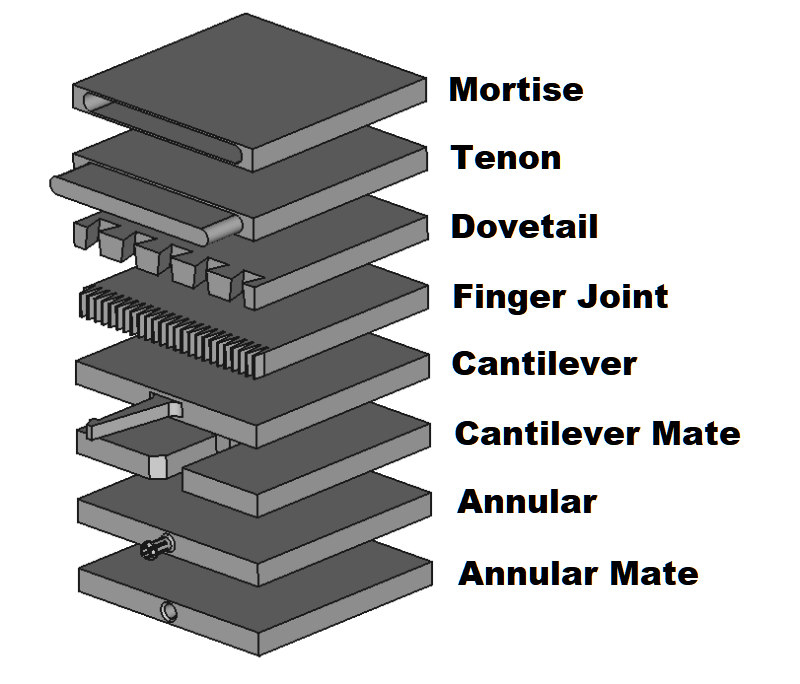

# Macro Joint (Work in progress)
Macro Joint is a macro to create joints in FreeCAD.  Usage: select a face and run the macro, select from the list the type of joint to make on that face.  Options are Mortise, Tenon, Box Joint, and Dovetail Joint.  A feature python object is created with user configurable editable properties.  Join works in Part Design and other workbenches.
 
 

## Toolbar Icon
<a href="Macro_Joint_Icon.svg">Download</a> the toolbar icon:  
 

## Installation
Not yet available in the addon manager.  Install by placing the Joint.FCMacro into your macro folder.  On first run it will offer to create a new file called joint.py.  This file is needed for the Joint feature python objects to be parametric and functional upon reloading documents containing these objects.

## Changelog
### 0.2021.11.30 == rework dovetail code
### 0.2021.11.26.rev2 == uncomment __version__ property
### 0.2021.11.26 == initial upload
